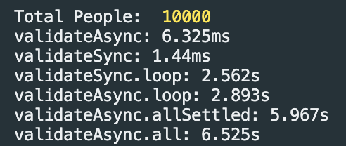
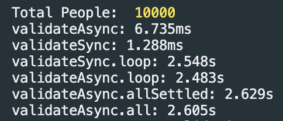

# yup-sync-validation

This repo is to serve as an example for [THIS PR](https://github.com/jquense/yup/pull/2053)

To run the example

```
npm install
npm run start
```

The `master` branch uses the latest yup 1.2 and yields the following results.



Then switch to the test branch and run the start command again.

```
git checkout test
npm run start
```

The `test` branch updates the node_modules to reflect the code in the PR and yields the following results

